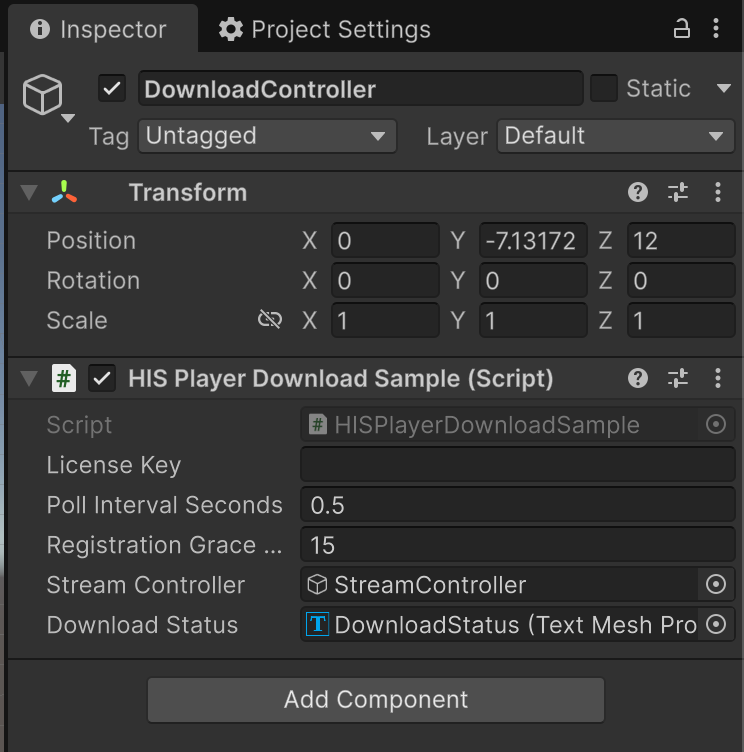

# Download Video Content for Offline Playback

The HISPlayer SDK supports downloading video content for offline playback. 
If you received a license key from HISPlayer, input the license key through the Unity Inspector window: **DownloadController GameObject > HISPlayer Download Sample (Script)** component > **License Key**.

<p align="center">

</p>

### Script

Please check the `Assets/OpenXRSample/Scripts/Sample/HISPlayerDownloadSample.cs` script. The script must inherit from `HISPlayerDownloadManager`. It is also necessary to add the `using HISPlayerAPI;` dependency.

```csharp
using System;
using System.Collections;
using System.Collections.Generic;
using UnityEngine;
using TMPro;
using HISPlayerAPI;

public class HISPlayerDownloadSample : HISPlayerDownloadManager
{
    ...
}
```

It is necessary to call `SetUpDownloader()` before calling any other APIs. This function initializes everything required to use the HISPlayer Download APIs.

## Download Video Content

There are two download APIs. The first one is `DownloadAdaptiveStream()`, which is used to download adaptive streaming content such as HLS and DASH. The second API is `DownloadProgressive()`.

### Adaptive Video Content (HLS, DASH) Download
Adaptive content downloading supports both non-DRM and Widevine DRM content.
Adaptive streaming content is composed of several different bitrate tracks. The downloaded content will include only one bitrate track because the content will be played locally.

#### Select a Bitrate Track
With the `maxWidth` and `maxHeight` parameters, you can specify the track to download. The SDK will internally select the highest bitrate track that meets your `maxWidth` and `maxHeight` values.

#### Select Audio and Subtitle Tracks
Content can include multiple audio and subtitle tracks. 
With the `audioLanguages` and `subtitleLanguages` parameters, you can specify which tracks will be downloaded.
Each parameter accepts a comma-separated language string. For example, if the content includes English, Korean, and French audio tracks and you want to download only the English and Korean tracks, you can set `audioLanguages` to `"en, kr"`. If you want to download all tracks, you can set the parameter to `NULL` or `"ALL"`.

### Progressive Video Content Download
The `DownloadProgressive()` API downloads a progressive file (for example, an MP4) for offline playback.

## Manage Downloaded Content
All downloaded content is identified by its content URL.
Downloaded files are stored in the local application's cache folder.
Therefore, if the application is uninstalled, all downloaded contents are removed as well.
We provide several APIs to manage downloaded content. Please refer to the [**HISPlayer API**](/hisplayer-api.md) for more details.

## Offline Playback

When playing content, the SDK internally checks whether the content has already been downloaded. If the content is available locally, it will play in offline mode. For partially downloaded content, the player will utilize the locally downloaded segments and seamlessly switch to streaming for any missing segments.
