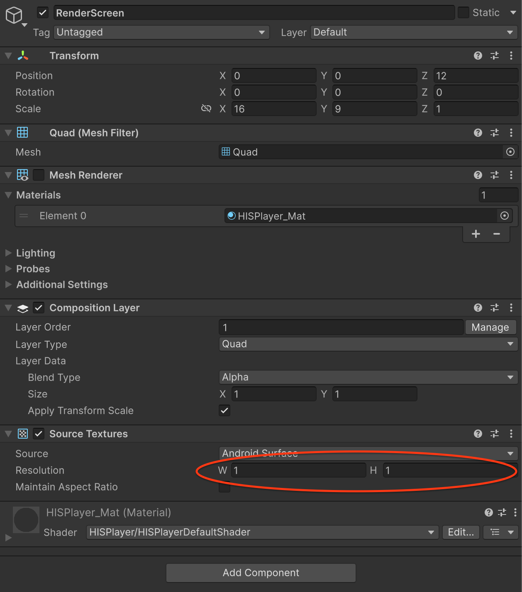

# RenderModes

HISPlayer supports multiple rendering modes to suit different use cases and platforms. The recommended mode for XR/VR applications is **External Surface (Composition Layer)**, which leverages the OpenXR composition layer for optimal performance and latency. Other modes like **RenderTexture**, **Material**, and **RawImage** are also available for 2D UI or non‑XR scenarios.

## External Surface (Composition Layer)

This mode uses **XR Composition Layers** to render video directly onto a composition layer, bypassing the main render pipeline for improved performance in XR headsets. It is the preferred choice for immersive VR experiences on Android (e.g., Galaxy XR, Meta Quest, Pico, etc.).

### Setup

1. Create an empty GameObject.
2. Attach the following components to it:
   - **Composition Layer** (from the XR Composition Layers package)
   - **Source Textures** (from the XR Composition Layers package). *The width (W) and height (H) values of the resolution must not be zero*. 
    
<p align="center">
  
</p>

3. In your script (inheriting from `HISPlayerManager`) set the `renderMode` to `HISPlayerRenderMode.ExternalSurface` in the `MultiStreamProperties`.

<p align="center">
  
</p>

4. Implement a coroutine to retrieve the native Android surface from the `CompositionLayer` and assign it to the `externalSurface` property of your stream. <br>
The resolution of the Source Textures cannot be zero, so a minimum value must be enforced. If the resolution is zero, acquiring the Android surface will fail.
The following example shows how to do this:

```C#
using Unity.XR.CompositionLayers;
using Unity.XR.CompositionLayers.Extensions;

[SerializeField] private GameObject renderScreen;
private IEnumerator SetUpExternalSurface()
{
    CompositionLayer layer = renderScreen.GetComponent<CompositionLayer>();

    IntPtr surfacePtr = IntPtr.Zero;
    int maxAttempts = 10;
    int attempts = 0;

    SetExternalSurfaceSize(renderScreen, 1, 1);

    while (surfacePtr == IntPtr.Zero && attempts < maxAttempts)
    {
        yield return new WaitForEndOfFrame();

        int layerId = layer.GetInstanceID();
        surfacePtr = UnityEngine.XR.OpenXR.CompositionLayers.OpenXRLayerUtility.GetLayerAndroidSurfaceObject(layerId);

        attempts++;
    }

    if (surfacePtr != IntPtr.Zero)
    {
        multiStreamProperties[streamIndex].externalSurface = surfacePtr;
        
    }
    SetUpPlayer();
}
```

> Important: SetUpPlayer() must be called after the surface is assigned and before using any other HISPlayer APIs. Additionally, the resolution of the **Source Textures** must match the original video resolution.

### Retrieving the Android Surface

The script uses the `OpenXRLayerUtility.GetLayerAndroidSurfaceObject()` method to obtain the native surface pointer from the `CompositionLayer` and assigns it to the `externalSurface` field before calling `SetUpPlayer()`.

### Updating the Resolution of Source Textures
The resolution of the **Source Textures** must match the original video resolution. Otherwise, the output video frames will be cropped or display garbage data. Therefore, the width (W) and height (H) must be updated whenever the original video resolution changes. Please override the `void EventVideoSizeChange(HISPlayerEventInfo eventInfo)` function and set the new resolution values within it.

```C#
protected override void EventVideoSizeChange(HISPlayerEventInfo eventInfo)
{
    if (!isPlaybackReady)
    {
        videoTracks = GetTracks(streamIndex);
    }

    if (videoTracks != null)
    {
        int width = (int)eventInfo.param1;
        int height = (int)eventInfo.param2;

        SetExternalSurfaceSize(renderScreen, width, height);
    }
}
```


## RenderTexture

This mode renders video to a `RenderTexture`, which can then be displayed on any 3D object or UI element. It is suitable for both XR and non‑XR projects.

### Setup

1. Create a **RenderTexture** asset via **Assets > Create > RenderTexture**.

<p align="center">
  
</p>

2. Create a **Material**, assign the **RenderTexture** to its `_MainTex property`, and ensure it uses the `HISPlayer/HISPlayerDefaultShader` shader for correct video rendering.

<p align="center">
  
</p>

3. Set the `renderMode` to `HISPlayerRenderMode.RenderTexture` in the `MultiStreamProperties` and assign the **RenderTexture** to the `renderTexture` field in your `HISPlayerManager` script.

<p align="center">
  
</p>

4. Assign the created Material to the MeshRenderer (or the appropriate renderer component) of the GameObject that will display the video.

<p align="center">
  
</p>

> **Tip:** Pre‑configured assets are available in the package:
> - **RenderTexture:** `Packages/HISPlayerSDK/HisPlayer/Resources/RenderTextures/HISPlayerRenderTexture.renderTexture`
> - **Material:** `Packages/HISPlayerSDK/HisPlayer/Resources/Materials/HISPlayerDefaultMaterialRenderTexture.mat` (already uses the correct shader)

### Linear Color Space

For **Linear Color Space** projects, it is essential to use the **`HISPlayer/HISPlayerDefaultShader`** shader in your Material to correct color issues. The pre‑configured Material (`HISPlayerDefaultMaterialRenderTexture.mat`) already includes this shader.

## Material

This mode renders video directly onto a standard Unity **Material**, which can be applied to any 3D object with a `MeshRenderer`.

### Setup

1. Create a **Material** and ensure it uses the `HISPlayer/HISPlayerDefaultShader` shader for correct video rendering.

<p align="center">
  
</p>

2. Set the `renderMode` to `HISPlayerRenderMode.Material` in the `MultiStreamProperties` and assign the **Material** to the `material` field in your `HISPlayerManager` script.

<p align="center">
  
</p>

3. Assign the created Material to the MeshRenderer (or the appropriate renderer component) of the GameObject that will display the video.

<p align="center">
  
</p>

> **Tip:** Pre‑configured assets are available in the package:
> - **Material:** `Packages/HISPlayerSDK/HisPlayer/Resources/Materials/HISPlayerDefaultMaterial.mat` (already uses the correct shader)

### Linear Color Space

For **Linear Color Space** projects, it is essential to use the **`HISPlayer/HISPlayerDefaultShader`** shader in your Material to correct color issues. The pre‑configured Material (`HISPlayerDefaultMaterial.mat`) already includes this shader.

## RawImage

This mode renders video to a **RawImage** component on a Unity UI Canvas, ideal for 2D overlays or in‑game menus.

### Setup

1. Create a **RawImage** UI element (**GameObject > UI > Raw Image**). A Canvas will be created automatically if none exists.
2. Set the `renderMode` to `HISPlayerRenderMode.RawImage` in the `MultiStreamProperties` and assign the **RawImage** to the `rawImage` field in your `HISPlayerManager` script.

<p align="center">
  
</p>

### Linear Color Space

No additional shader changes are required for Raw Image mode.
