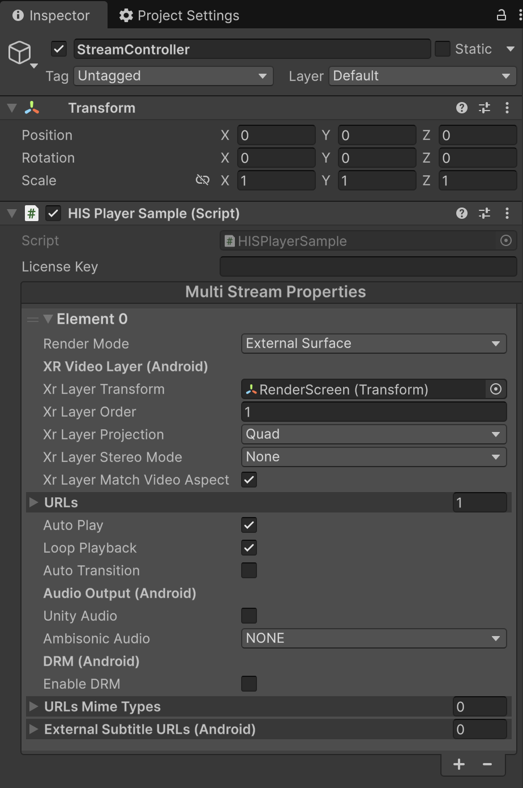

# Render Modes

HISPlayer supports multiple rendering modes to suit different use cases and platforms. The recommended mode for XR/VR applications is **External Surface (Composition Layer)**, which leverages the OpenXR composition layer for optimal performance and latency. Other modes like **RenderTexture**, **Material**, and **RawImage** are also available for 2D UI or non‑XR scenarios.

## External Surface

This mode uses **XR Video Layers**, which are created and managed inside the HISPlayer SDK to render video directly onto an Android Surface, bypassing the main render pipeline for improved performance in open XR headsets. It is the preferred choice for immersive VR experiences on Android (e.g., Galaxy XR, Meta Quest, Pico, etc.).

### Setup

1. Create an empty GameObject.

  

> Important: There is no need to add any additional components. The HISPlayer SDK will automatically add the XR Video Layer component internally.
    
2. In your script (inheriting from `HISPlayerManager`), set the `renderMode` to `HISPlayerRenderMode.ExternalSurface` in the `MultiStreamProperties`.

  

3. Set the properties related to External Surface:
  * **Xr Layer Transform**: Use this property to set the position and size of the video. Assign the GameObject on which the video will be displayed (RenderScreen). This is a mandatory property.
  * **Xr Layer Order**: Composition order, default is 1. A negative value puts the video below the scene. Do not set it to 0. <u>*If multiple streamProperties are used, this value should not be the same for each stream. If **Xr Layer Stereo Mode** is not **None**, each stream uses two layers (left and right eye), so an N + 1 layer order value is used internally — so be careful when setting this value across multiple streamProperties.*</u>
  * **Xr Layer Projection**: The shape type used to display the video. [Quad, Equirect360 or Equirect180]
  * **Xr Layer Stereo Mode**: The stereo mode. [None, LeftRight or TopBottom]
  * **Xr Layer Match Video Aspect**: Keeps the original source video's aspect ratio within the **Xr Layer Transform** region. **Quad only**
  * **Xr Layer Radius**: Radius of the Equirect screen. 0 means an infinite sphere. **Equirect 360/180 only**

> Important: Do not set the `StreamProperties.externalSurface` property. This property is set automatically by the SDK.

## RenderTexture

This mode renders video to a `RenderTexture`, which can then be displayed on any 3D object or UI element. It is suitable for both XR and non‑XR projects.

### Setup

1. Create a **RenderTexture** asset via **Assets > Create > RenderTexture**.

  

2. Create a **Material**, assign the **RenderTexture** to its `_MainTex property`, and ensure it uses the `HISPlayer/HISPlayerDefaultShader` shader for correct video rendering.

  

3. Set the `renderMode` to `HISPlayerRenderMode.RenderTexture` in the `MultiStreamProperties` and assign the **RenderTexture** to the `renderTexture` field in your `HISPlayerManager` script.

  

4. Assign the created Material to the MeshRenderer (or the appropriate renderer component) of the GameObject that will display the video.

  

> **Tip:** Pre‑configured assets are available in the package:
> - **RenderTexture:** `Packages/HISPlayerSDK/HisPlayer/Resources/RenderTextures/HISPlayerRenderTexture.renderTexture`
> - **Material:** `Packages/HISPlayerSDK/HisPlayer/Resources/Materials/HISPlayerDefaultMaterialRenderTexture.mat` (already uses the correct shader)

### Linear Color Space

For **Linear Color Space** projects, it is essential to use the **`HISPlayer/HISPlayerDefaultShader`** shader in your Material to correct color issues. The pre‑configured Material (`HISPlayerDefaultMaterialRenderTexture.mat`) already includes this shader.

## Material

This mode renders video directly onto a standard Unity **Material**, which can be applied to any 3D object with a `MeshRenderer`.

### Setup

1. Create a **Material** and ensure it uses the `HISPlayer/HISPlayerDefaultShader` shader for correct video rendering.

  

2. Set the `renderMode` to `HISPlayerRenderMode.Material` in the `MultiStreamProperties` and assign the **Material** to the `material` field in your `HISPlayerManager` script.

  

3. Assign the created Material to the MeshRenderer (or the appropriate renderer component) of the GameObject that will display the video.

  

> **Tip:** Pre‑configured assets are available in the package:
> - **Material:** `Packages/HISPlayerSDK/HisPlayer/Resources/Materials/HISPlayerDefaultMaterial.mat` (already uses the correct shader)

### Linear Color Space

For **Linear Color Space** projects, it is essential to use the **`HISPlayer/HISPlayerDefaultShader`** shader in your Material to correct color issues. The pre‑configured Material (`HISPlayerDefaultMaterial.mat`) already includes this shader.

## RawImage

This mode renders video to a **RawImage** component on a Unity UI Canvas, ideal for 2D overlays or in‑game menus.

### Setup

1. Create a **RawImage** UI element (**GameObject > UI > Raw Image**). A Canvas will be created automatically if none exists.
2. Set the `renderMode` to `HISPlayerRenderMode.RawImage` in the `MultiStreamProperties` and assign the **RawImage** to the `rawImage` field in your `HISPlayerManager` script.

  

### Linear Color Space

No additional shader changes are required for Raw Image mode.
