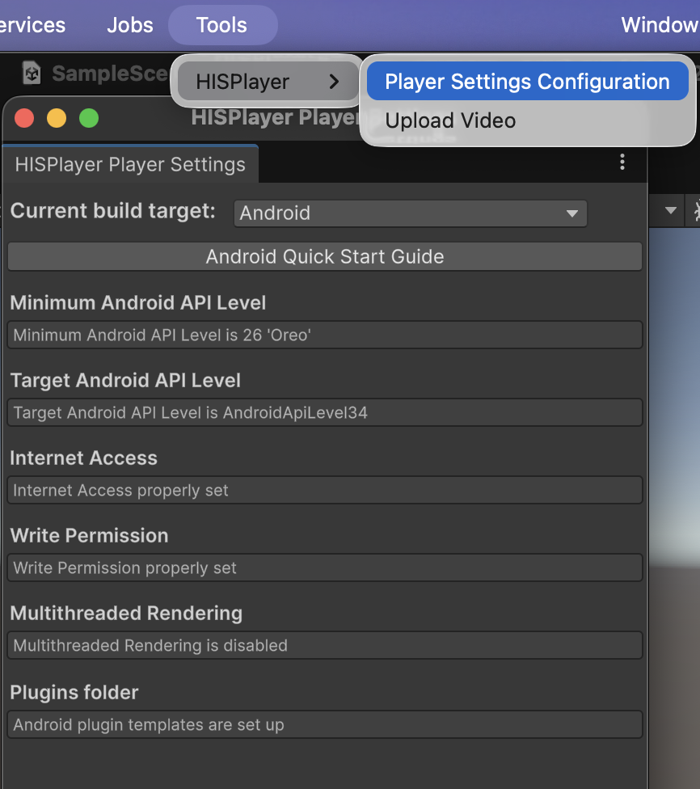
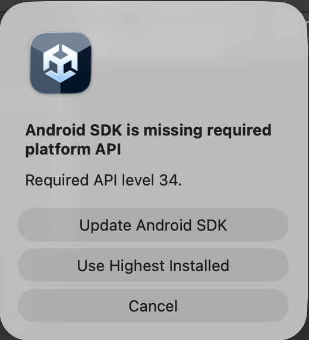

# QuickStart Guide
Getting started with HISPlayer consists of implementing the following steps:

1. Import and configure SDKs

      1.1. Import Unity Packages
 
      1.2. Import HISPlayer SDK
 
      1.3. Configure Unity for Android

      1.4 Configure OpenXR
   
3. HISPlayer VR SDK Sample
   
    2.1 Import HISPlayer VR SDK Sample

## 1.1 Import Unity Packages

You must install a set of specific packages to ensure OpenXR and the VR interactions work correctly.

1. In the top menu bar, go to **Window > Package Manager**.

2. In the Package Manager window, click the dropdown menu in the top-left corner (it usually says Packages: In Project by default) and select **Packages: Unity Registry**.

<p align="center">

</p>

3. Use the search bar in that says “Search in Unity Registry” to find and select each of the following packages, then click the **Install** button for each one:
    - XR Interaction Toolkit
    - XR Plugin Management
    - XR Composition Layers
    - OpenXR Plugin

4. Import Starter Assets:
    - In the Package Manager, select the installed **XR Interaction Toolkit** from the list.
    - On the right-side panel, click on the **Samples** tab.
    - Locate **Starter Assets** in the list and click the **Import** button next to it.

<p align="center">

</p>

5. Import TMP Essentials (For UI Text):
    - In the top menu bar, go to **Window > TextMeshPro > Import TMP Essential Resources**.
    - A new pop-up window will appear. Click the **Import** button.

<p align="center">

</p>

## 1.2 Import HISPlayer SDK

Importing the SDK is the same as importing other normal packages in Unity. 
Select the package of _HISPlayer SDK_ and import it.

**Assets > Import Package > Custom Package > HISPlayer VR SDK unity package**

Select the package of _HISPlayer SDK_ and import it.

<p align="center">

</p>

## 1.3 Configure Unity for Android

Open the window **Tools > HISPlayer** located in the upper side of the screen > Click on Player Settings Configuration > Select **Build Target to Android** > Set all the required settings.

<p align="center">

</p>

Setting **"Plugins folder"** will create **mainTemplate.gradle** and **gradleTemplate.properties** in your ProjectRoot\Assets\Plugins\Android. Please make sure you use the correct **mainTemplate.gradle** that is generated from our SDK. If you need to modify it, please make sure the dependencies and configurations from HISPlayer SDK's mainTemplate.gradle exist in your modified gradle file.

#### Android Target API Level
It is recommended to set Target API Level to 34 or higher. By selecting Android target 34, Unity is going to ask you to update (in the case you don't have the SDK installed). Please, press "Update Android SDK" button.

<p align="center">

</p>

Alternatively, you may set the Target API level to 34 or higher in the Unity project settings.

## 1.4 Configure OpenXR

**XR Plugin Management Setup**:
1. Go to the top menu bar and click **Edit > Project Settings**.
2. In the left-hand list of the Project Settings window, scroll down and select **XR Plug-in Management**.
3. In the main panel, click on the **Android Tab**.
4. Check the box next to **OpenXR** in the Plug-in Providers list.

<p align="center">

</p>

5. If a yellow/red warning triangle appears next to OpenXR, click on the **triangle icon**. A validation window will pop up. Click the **Fix All** button to automatically resolve configuration issues.

**OpenXR Settings**:
1. In the left-hand list of the Project Settings window, click on **OpenXR** (located directly under XR Plug-in Management).

<p align="center">

</p>

2. **Interaction Profiles**:
    - Look for the "Interaction Profiles" section.
    - Click the **"+" (plus)** icon under the list.
    - Select **Khronos Simple Controller Profile**.
    - Click the **"+" (plus)** icon again.
    - Select **Oculus Touch Controller Profile** or other controller profile depending on your VR headsets.

<p align="center">

</p>

3. **OpenXR Feature Groups**:
    - Scroll down to the bottom of the OpenXR settings panel.
    - Check the box for **Meta Quest Support** or other option depending on your VR headset. 
    - Check the box for **Composition Layer Support**.

<p align="center">

</p>

 
## 2.1 Import HISPlayer VR SDK Sample

Please, download the sample here: [**OpenXRSample**](https://downloads.hisplayer.com/Unity/VR/HISPlayer_VR_SDK_Sample.unitypackage) (no need to download it if you have received it in the email). 

Before using the sample, please make sure you have followed the above steps to set-up your Unity project for  and HISPlayer SDK. To use the sample, please follow these steps :
  - Configure OpenXR
  - Import HISPlayer SDK
  - Import HISPlayer VR SDK Sample
  - Open Assets/OpenXRSample/Scenes/HEVC_8K.unity
  - Import TextMeshPro. Go to Unity Window > TextMeshPro > Import TMP Essential Resources
  - If you received a license key from HISPlayer, input the license key through the Inspector Unity window: **StreamController GameObject > HISPlayerSample component > License Key**
  - Open File > Build Settings > Add Open Scenes
  - Build and Run

To check how to set up the SDK and API usage, please refer to Assets/OpenXRSample/Scripts/Sample/**HISPlayerSample.cs** and **StreamController** GameObject in the Editor.

## Sample Explanation and SDK Usage

### Editor Setup

The **RenderScreen** GameObject is a Quad that displays the video. Its components are configured automatically via script based on the selected render mode:

- **Mesh Filter** – defines the Quad geometry.
- **Mesh Renderer** – enabled when `RenderMode` is **not** `ExternalSurface` (i.e., for `RenderTexture` mode).
- **Composition Layer** – enabled when `RenderMode` is `ExternalSurface` (provided by **XR Composition Layers**).
- **Source Textures** – enabled when `RenderMode` is `ExternalSurface`; provides texture access for the composition layer.

> **Note:** The script toggles these components automatically. You do not need to manually enable/disable them.

#### RenderMode Selection

In the HISPlayer multistream properties, set the **RenderMode** to **External Surface** or **RenderTexture**.  
Go to **StreamController** GameObject > **HISPlayerSample** script > **MultiStreamProperties** > **Element 0** > **RenderMode**.

<p align="center">
  
</p>

#### Scene Components

The example scenes include the following key GameObjects and components:

- **RenderScreen** – the video display surface (Quad with Mesh Filter, Mesh Renderer, Composition Layer, Source Textures).
- **StreamController** – holds the `HISPlayerSample.cs` script. Here you configure the **license key**, video settings, and UI references.
- **XR Interaction Manager** – acts as an intermediary between Interactors and Interactables in the scene. It is required for any XR interaction to function.
- **XR Origin** – transforms XR tracking data into scene world space. It controls the attached camera to track the user’s headset and controllers. It typically contains:
  - **Input Action Manager** – automatically enables or disables a list of Input Action Assets. Input actions must be enabled before they can be used.
  - **XR Input Modality Manager** – automatically switches between hand tracking and motion controllers at runtime based on which input method is currently tracked.

### Scene-Specific Notes

#### HEVC_8K Scene

This scene demonstrates high-resolution video playback using `ExternalSurface` mode with the Composition Layer setup described above.

#### 360° Scene

This scene demonstrates 360° video playback using **RenderTexture** mode. The `RenderScreen` GameObject uses a **Sphere** as its Mesh Filter and only has a **Mesh Renderer** (no Composition Layer or Source Textures). This is the recommended configuration for equirectangular projections.

#### Ambisonic Audio Scene

For information about Ambisonic audio support, please refer to [Ambisonic](/ambisonic.md)

### Script

Please check Assets/OpenXRSample/Scripts/Sample/**HISPlayerSample.cs** script. The script must inherit from **HISPlayerManager**. It is necessary to add the **'using HISPlayerAPI;'** dependency

```C#
using System.Collections;
using System.Collections.Generic;
using UnityEngine;
using HISPlayerAPI;

public class HISPlayerSample : HISPlayerManager
{
    ...
}
```

Next, please refer to the **SetUpExternalSurface()** function:
- Find the **CompositionLayer** component from the GameObject (**RenderScreen**) that we have created.
- When the external surface object has been created (retrieved via `OpenXRLayerUtility.GetLayerAndroidSurfaceObject()`):
  - Set the external surface to HISPlayer multistream properties's **externalSurface** object.
  - Call **SetUpPlayer()** to initialize the player and load the stream.

It is necessary to call SetUpPlayer() before calling other APIs. This function initializes everything else that will be needed during the usage of HISPlayer APIs.

### Non-DRM Video Playback
If you are not playing a DRM protected content, please modify the **MultiStreamProperties** by unchecking the **Enable DRM** checkbox to disable DRM and remove all element from **Key Server URI** list.

<p align="center">
  
</p>

### Stereoscopic Video Playback
Refer to [**Stereoscopic Video**](./stereoscopic.md).

## More Information, Features and APIs
For more information about the supported features and APIs, please refer to the following [**HISPlayer API**](/hisplayer-api.md).
